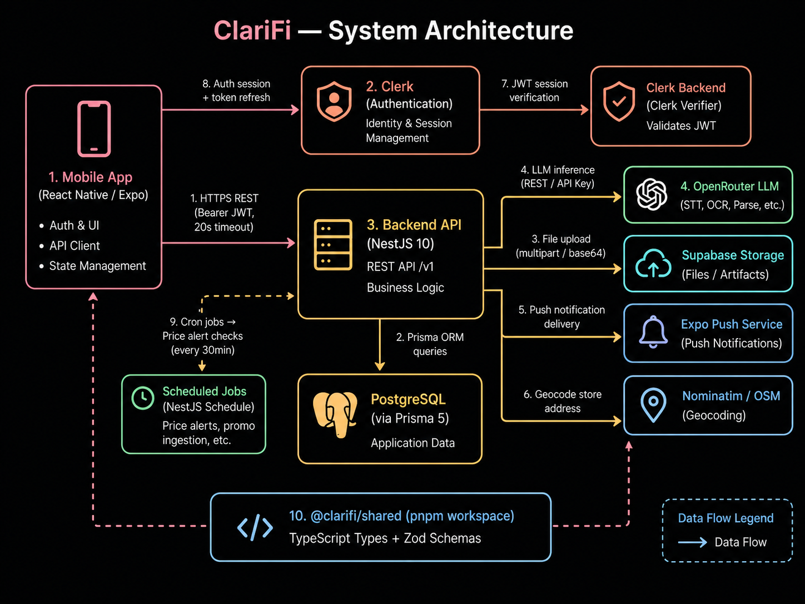

# ClariFi

ClariFi is a personal finance app built for fast expense capture and community-powered price intelligence. Users can log expenses by voice or receipt photo, track monthly spending, and compare grocery prices across nearby stores — including basket-level recommendations that factor in proximity.

- **Final Pitch Deck:** [ClariFi_Presentation.pdf](ClariFi_Presentation.pdf)
- **Refinement Changelog:** [Refinement_Changelog.pdf](Refinement_Changelog.pdf)
- **Live Product Demonstration Video:** [Backup Demo Video.mp4](Backup%20Demo%20Video.mp4)
- **Backend Live Deployment:** http://54.188.161.56/v1/health/live

## Stack

| Layer              | Technology                                                  |
| ------------------ | ----------------------------------------------------------- |
| Mobile             | Expo 54 (React Native), React 19                            |
| API                | NestJS 10, Prisma 5                                         |
| Database           | PostgreSQL                                                  |
| Auth               | Clerk                                                       |
| Storage            | Supabase Storage                                            |
| AI                 | OpenRouter — GPT-4.1-mini for OCR, STT, and expense parsing |
| Push notifications | Expo Push                                                   |
| Shared contracts   | Zod + TypeScript                                            |

## Monorepo Layout

```
apps/
  api/       — NestJS backend (src/modules/, prisma/, scripts/)
  mobile/    — Expo React Native app
packages/
  shared/    — Zod/TypeScript types shared between API and mobile
```

## Prerequisites

- Node.js 20+
- pnpm 10
- PostgreSQL (local or remote)
- Xcode with iOS Simulator (macOS only, for running the mobile app)

## Getting Started

### 1. Install dependencies

```bash
pnpm install
```

### 2. Configure the backend

```bash
cp apps/api/.env.example apps/api/.env
```

Edit `apps/api/.env` with the values below. The rest have working defaults.

| Variable                                     | Required    | Notes                                                     |
| -------------------------------------------- | ----------- | --------------------------------------------------------- |
| `DATABASE_URL`                               | Yes         | PostgreSQL connection string                              |
| `CLERK_SECRET_KEY`                           | Yes         | From the Clerk dashboard                                  |
| `OPENROUTER_API_KEY`                         | Conditional | Not needed if you set `EXPENSE_PARSER_PROVIDER=heuristic` |
| `SUPABASE_URL` / `SUPABASE_SERVICE_ROLE_KEY` | Yes         | For receipt image storage                                 |

Run database migrations:

```bash
pnpm --filter @clarifi/api prisma:migrate
```

### 3. Start the backend

```bash
pnpm dev:api
# API available at http://localhost:3000/v1
```

### 4. Configure the mobile app

```bash
cp apps/mobile/.env.example apps/mobile/.env
```

Edit `apps/mobile/.env`:

```env
EXPO_PUBLIC_API_BASE_URL=http://localhost:3000/v1
EXPO_PUBLIC_CLERK_PUBLISHABLE_KEY=your_clerk_publishable_key
EXPO_PUBLIC_STT_ON_DEVICE_ENABLED=true
```

> Use `http://localhost:3000/v1` for the iOS Simulator. When testing on a physical iPhone on the same network, replace `localhost` with your machine's LAN IP (e.g. `http://192.168.x.x:3000/v1`).

### 5. Launch the iOS Simulator

```bash
pnpm --filter @clarifi/mobile ios
```

This generates the native iOS project if needed, opens the Simulator, and starts the app against your local backend.

### 6. Verify the connection

After signing in, open the **Account** tab and tap:

- **Check health** — confirms `/v1/health/live` and `/v1/health/ready` are responding
- **Sync user** — registers your Clerk identity with the backend

Both should succeed before testing other features.

## API Reference

All routes require a valid Clerk session token and are prefixed with `/v1`. Health endpoints are unauthenticated.

| Module        | Routes                                                                                                                           |
| ------------- | -------------------------------------------------------------------------------------------------------------------------------- |
| Health        | `GET /health/live`, `GET /health/ready`                                                                                          |
| Auth          | `POST /auth/clerk`                                                                                                               |
| Parse         | `POST /parse/voice`, `POST /parse/receipt`                                                                                       |
| Expenses      | `GET /expenses`, `POST /expenses`, `GET/PATCH/DELETE /expenses/:id`                                                              |
| Reports       | `GET /reports/monthly`                                                                                                           |
| Prices        | `GET /prices/compare`, `POST /prices/compare/multi`, `GET /prices/history`, `GET /prices/signal`, `GET /prices/locations/search` |
| Alerts        | `GET/POST /prices/alerts`, `PATCH/DELETE /prices/alerts/:alertId`, `GET /prices/alerts/events`                                   |
| Promos        | `POST /prices/promos/ingest`, `POST /prices/promos/confirm`, `GET /prices/promos`                                                |
| Families      | `GET/POST /families`, `POST /families/invite`, `POST /families/join`                                                             |
| Splits        | `GET/POST /splits`, `PATCH /splits/:id`                                                                                          |
| Notifications | `POST /notifications/devices`                                                                                                    |
| Rewards       | `GET /rewards`, `POST /rewards/redeem`                                                                                           |
| Contributions | `GET /contributions`                                                                                                             |
| Subscriptions | `GET /subscriptions`                                                                                                             |

## Architecture Diagram (Direct)



## What's New

| Feature                      | Preliminary Version                                                                                                                              | Refined Version                                                                                                                                                                                                                                                |
| ---------------------------- | ------------------------------------------------------------------------------------------------------------------------------------------------ | -------------------------------------------------------------------------------------------------------------------------------------------------------------------------------------------------------------------------------------------------------------- |
| **AI Fast Expense Capture**  | Voice or receipt photo capture. User reviews the parsed result and confirms it.                                                                  | Unchanged. Core frictionless capture remains the foundation of the product.                                                                                                                                                                                    |
| **Price Comparison Feature** | Converts captured bills and promotional brochures into price observations. Users can search for one item and compare prices at different stores. | Powered by direct partnerships with local groceries or supermarkets and crowdsourced receipts, building a living, real-time local price database.                                                                                                              |
| **Bucket Feature**           | Not fully implemented in the preliminary version.                                                                                                | Users can add multiple items into a list and build a price matrix across nearby stores. The system calculates total basket cost at each location, weights results by proximity, and recommends the single most worthwhile store to buy everything in one trip. |
| **Expense Breakdown**        | View and filter recorded expenses.                                                                                                               | Unchanged. Surfaces spending patterns and category-level leaks on a monthly basis.                                                                                                                                                                             |
| **Alerts & Notifications**   | Create threshold alerts and receive event notifications when conditions are met.                                                                 | Unchanged. Proactively notifies users of price changes and budget thresholds.                                                                                                                                                                                  |
| **AI Purchase Insights**     | Not included in the preliminary version.                                                                                                         | AI analyses each purchase, flags overspending, directs users to cheaper alternatives using Community Price Intelligence, and explains price increases through real economy trends.                                                                             |
| **Family Profile**           | Share a family profile to track each other's spending and share promotions or deals.                                                             | Retained as a supporting feature. Enables shared household visibility and expense splitting.                                                                                                                                                                   |

The refined version of ClariFi improves the project in three major ways:

1. **Clearer consumer-facing problem framing** The problem is now centred around "Data Darkness", making it easier for users and judges to understand the real pain point.
2. **Stronger feature logic** The price comparison feature has evolved from single-item lookup into a basket-based recommendation system that considers both total cost and proximity.
3. **More convincing AI validation** The AI logic is now better defined through capture intelligence, purchase intelligence, and basket intelligence, each with specific technologies, reasoning methods, and outputs.
